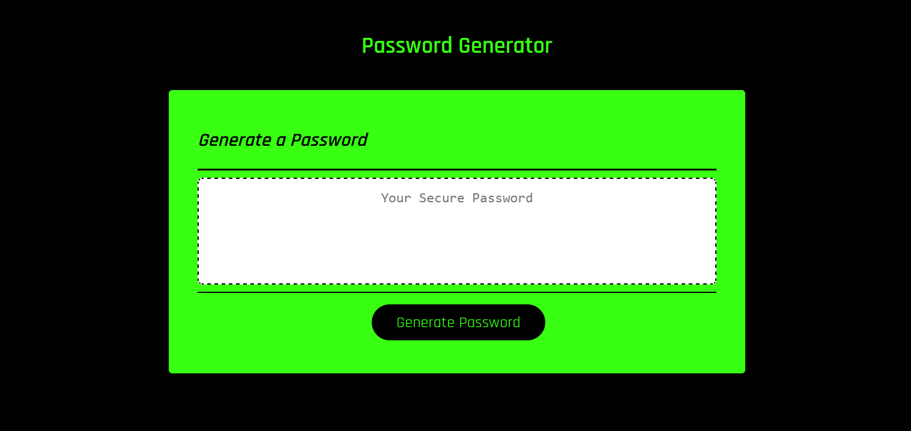

<h1 align="center">Password Generator App</h1>

## Description 

I created an application that an employee can use to generate a random password based on criteria they’ve selected. This app runs in the browser, and features dynamically updated HTML and CSS powered by JavaScript code. The app is responsive, ensuring that it adapts to multiple screen sizes.

## Technologies
- HTML
- CSS
- JavaScript

## Table of Contents

- [Installation](#installation)
- [Usage](#usage)
- [Screenshot](#screenshot)
- [License](#license)

## User Story
AS AN employee with access to sensitive data 
I WANT to randomly generate a password that meets certain criteria 
SO THAT I can create a strong password that provides greater security 

## Acceptance Criteria
GIVEN I need a new, secure password 
WHEN I click the button to generate a password 
THEN I am presented with a series of prompts for password criteria 
WHEN prompted for password criteria 
THEN I select which criteria to include in the password 
WHEN prompted for the length of the password 
THEN I choose a length of at least 8 characters and no more than 128  
WHEN asked for character types to include in the password 
THEN I confirm whether or not to include lowercase, uppercase, numeric, and/or special characters 
WHEN I answer each prompt 
THEN my input should be validated and at least one character type should be selected 
WHEN all prompts are answered 
THEN a password is generated that matches the selected criteria 
WHEN the password is generated 
THEN the password is either displayed in an alert or written to the page

## Installation

No installation required.

## Usage
Live link [here](https://brianlockerbie.github.io/password-generator-app/)

## Screenshot

## License

